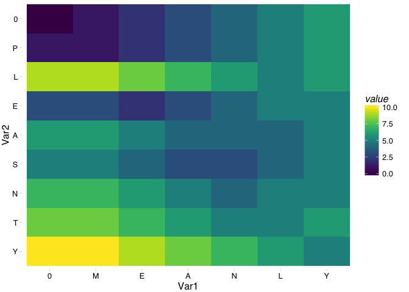

Edit Distance
================
Dominic Pearce

[Problem : Minimum Edit Distance](%22http://rosalind.info/problems/edit/%22)

``` r
library(tidyverse)
library(knitr)
```

### Input

``` r
s <- "PLEASANTLY" %>% strsplit(., "") %>% .[[1]]
t <- "MEANLY" %>% strsplit(., "") %>% .[[1]]
```

### Create a matrix of zeros `length(s) + 1` x `length(t) + 1`, and set the first row and column to 0-length(s) and 0:length(t respectively)

``` r
mtxDefine <- function(s, t){
    s_len <- length(s)
    t_len <- length(t)
    edit_mtx <- matrix(rep(0, ((s_len+1)*(t_len+1))), nrow = t_len+1, ncol = s_len+1)
    edit_mtx[1,] <- 0:s_len
    edit_mtx[,1] <- 0:t_len
    colnames(edit_mtx) <- c("0", s)
    row.names(edit_mtx) <- c("0", t)
    edit_mtx
}

edit_mtx <- mtxDefine(s, t)
```

 

|     |    0|    P|    L|    E|    A|    S|    A|    N|    T|    L|    Y|
|-----|----:|----:|----:|----:|----:|----:|----:|----:|----:|----:|----:|
| 0   |    0|    1|    2|    3|    4|    5|    6|    7|    8|    9|   10|
| M   |    1|    0|    0|    0|    0|    0|    0|    0|    0|    0|    0|
| E   |    2|    0|    0|    0|    0|    0|    0|    0|    0|    0|    0|
| A   |    3|    0|    0|    0|    0|    0|    0|    0|    0|    0|    0|
| N   |    4|    0|    0|    0|    0|    0|    0|    0|    0|    0|    0|
| L   |    5|    0|    0|    0|    0|    0|    0|    0|    0|    0|    0|
| Y   |    6|    0|    0|    0|    0|    0|    0|    0|    0|    0|    0|

 

### Fill matrix using following rules

-   if s\[j\] == t\[i\]
    -   mtx\[i, j\] = mtx\[i-1, j-1\]
    -   else mtx\[i, j\] = which ever of the left, diagUpLeft, or up cells are smallest + 1

``` r
for(i in 1:length(t)){
    for(j in 1:length(s)){
        if(s[j] == t[i]){
            edit_mtx[i+1, j+1] <- edit_mtx[i, j]
        } else {
            edit_mtx[i + 1, j + 1] <- min(edit_mtx[i, j], edit_mtx[i, j+1], edit_mtx[i+1, j]) + 1
        }
    }
}
```

 

|     |    0|    P|    L|    E|    A|    S|    A|    N|    T|    L|    Y|
|-----|----:|----:|----:|----:|----:|----:|----:|----:|----:|----:|----:|
| 0   |    0|    1|    2|    3|    4|    5|    6|    7|    8|    9|   10|
| M   |    1|    1|    2|    3|    4|    5|    6|    7|    8|    9|   10|
| E   |    2|    2|    2|    2|    3|    4|    5|    6|    7|    8|    9|
| A   |    3|    3|    3|    3|    2|    3|    4|    5|    6|    7|    8|
| N   |    4|    4|    4|    4|    3|    3|    4|    4|    5|    6|    7|
| L   |    5|    5|    4|    5|    4|    4|    4|    5|    5|    5|    6|
| Y   |    6|    6|    5|    5|    5|    5|    5|    5|    6|    6|    5|

 

### As a heatmap

 


