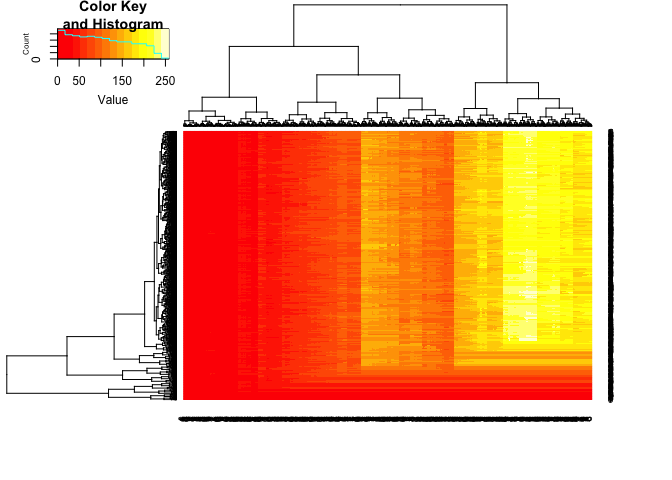

Finding a shared splice motif
================
Dominic Pearce

### [The puzzle](http://rosalind.info/problems/lcsq/)

This puzzle boils down to, given two strings find the longest common sub*sequence*. Remember that a subsequence is not the same thing as a substring!

``` r
#s <- "CCCACCCGTATCGAG" %>% strsplit(., "") %>% .[[1]]
#t <- "ACCCGGTATATCTTA" %>% strsplit(., "") %>% .[[1]]
s <- "ACAGAATTACTGTGCCTTCCTCTATACTCCCGCCCTTACAACTCTGGTTGCCCCCGGCGATCCCCTGCTCTTGGGACCCGGTGGCGGTGAAGATCCCCTTTAGTTGCGAGTTTTTAACACCGGTGCCGTAAAGAGTACGCAAGCCGAAGTCTCGGATGCAGGCGCATTGTTAGCCCGGAATGTGAAACCCCTGTTCTCCGGCATTTGTCGTTAGAGGGATCTTCGGTCCGAGCCTTGAGAGTTTCGGGCCCGCGTTGAGACCCAGAGGTAGACAGTACGAAAGTCTATTGGCGGGTCAATAGTACTGAGTGAAAAGTCCCATGATCCGTTTGTCTCGACTATCGAAATATTCTTTACCCAAACTAGAGAGGTTATCGAGCCGGCTAACTTATCACTGTCTCAGGAACCCCGGCTCTTCGTCCGTATCGCAAGTGGTGGAAGAATGCGCTACAGGCGCCCCATAGGGATGCGTATACTCCCTGCTCCCTTGCGTGAGAAAATAGGCTCGTTTACTAAAACCGTACGCTACAGGAAGAGATACCCTGCCAAGATCAATGTGCTCGGGATCACTATTATCTACGACCCCGAGTCTATGTCTACCTCAGGTTAGATGCAAGCTGTTCTTGGAGAGGCGCAGGCTCTGACGTCGCGGGCAGTGAGTGAACGCATGAAAAGTGACACAGACGACGACTTGCGTACCTGTAATTCATCGCATAGGACAAGCGAGTTTTTGAATGTATCACGTACAACCCACTAAGGCTCATCGTACTTACTGGAGCGTAATAGCAGCAGGCTCACGTACCTCAAGTCTCTGCTGCGATCGTCGCCCACCTAATTGTGGGAACGTGAAAGGCAAGCCCCTTACTATAGACCTAAATCTAGACTGCCTAACTACAAGATGACTAAAAGCAT" %>% strsplit(., "") %>% .[[1]]
t <- "TCTTCCGCTATGAATGGTGACCCTGTATAACTCTCAGAACACGAACACCATCGCAATAAGATTAAGATCTTTTGCCGGGGTAGATGCTTAATTAGTCTGAAAGTTGCATAATGACCTGCTATCGAAACTTACCATCATGACTTATCCCCAACAATGTCGGACCGTTCCCCCAGGGAAGAACTAATGCTGGCAATCCCCCAGGAAGATCTAGTGACCGATGCTAGCTGAGTGAGACTCTCTGTCGCTTCAGGGTACAGGTCCATCGTCGGAATCGGACCGTTCTAATAAAGTGGCGCTGGTAATGCCAACCCCGGGAGAGGCTGGTGCGCCGTCCTTGCTTAGGAATGCATGTCCTGCTATACTATCGGAGTCCTCCGTAGTCAATCGCGGCCTTCTGAATTAACGCGATCGCTCACATGGTGTATATGCCCAATAAAATAAGTATGAATATGCATGCTTTTATATCAAGCATCTAGAATCACTGGGTGAGAGAGAGATGCTCTGATAGCATCGTCCCACGATGCTACTTCTGGGCTTACCAATGATCTTCAATACACCGAGTATATTGCAAACGACCGGACCGACACTCGACATCGGCTTGGCAACGACCGTAGATATGGGTGTTGGTAGTGATAACAGCTGTTGTGCAGAAAGTCGAGCAGCACAGGATTCCTGCGTCAAGCAGGCCGAGACTCCGGTCATGAATCAGTAAAGAACCGCGACGAATCAATCACACCCAGCGGGCGCTAAGAGGCCGACGCACCGACAAATTTCAGTTAGCCCGCGCTCAGCCACCTAATGCACTCGTGGGTTGTGTACTTAGACCACATAGATGGCCCGACTACTTTTAACCGCGCTGACTGCATAGAAAAATGCAAACCGCCGCAACTAGGCGAAAGTACAGTTTGATAACCTGTAGCCACT" %>% strsplit(., "") %>% .[[1]]

s_len <- length(s)
t_len <- length(t)
```

Because I haven't solved the previous solutions using the ~~memoic~~ approach I needed to figure that out first. Below is a solution for the longest common sub*string*

#### Create empty matrix (with extra 0 row & column)

``` r
lcs_mtx <- matrix(rep(0, (s_len+1*t_len+1)), nrow = t_len+1, ncol = s_len+1)

colnames(lcs_mtx) <- c("0", s)
row.names(lcs_mtx) <- c("0", t)

lcs_mtx[1:5, 1:5]
```

    ##   0 A C A G
    ## 0 0 0 0 0 0
    ## T 0 0 0 0 0
    ## C 0 0 0 0 0
    ## T 0 0 0 0 0
    ## T 0 0 0 0 0

#### Loop through finding matches between strings, scoring by adding 1 + the value positioned north-west of the match

``` r
for (i in 1:s_len){
  for (j in 1:t_len){
    if (s[i] == t[j]){
      lcs_mtx[j+1, i+1] <- lcs_mtx[j, i] + 1
    }
  }
}

lcs_mtx[1:10, 1:10]
```

    ##   0 A C A G A A T T A
    ## 0 0 0 0 0 0 0 0 0 0 0
    ## T 0 0 0 0 0 0 0 1 1 0
    ## C 0 0 1 0 0 0 0 0 0 0
    ## T 0 0 0 0 0 0 0 1 1 0
    ## T 0 0 0 0 0 0 0 1 2 0
    ## C 0 0 1 0 0 0 0 0 0 0
    ## C 0 0 1 0 0 0 0 0 0 0
    ## G 0 0 0 0 1 0 0 0 0 0
    ## C 0 0 1 0 0 0 0 0 0 0
    ## T 0 0 0 0 0 0 0 1 1 0

``` r
knitr::opts_chunk$set(echo = TRUE, message = FALSE, warning = FALSE)
```

#### Then find the highest value - i.e. the last character of the longest substring - and work backwards until the current matrix value is 0

``` r
cur_coord <- which(lcs_mtx == max(lcs_mtx), arr.ind = TRUE)
cur_coord
```

    ##   row col
    ## G 785 178
    ## A 128 348
    ## T 801 837

``` r
lcs <- c()

while (lcs_mtx[cur_coord] > 0){
  lcs <- c(lcs, s[cur_coord[2]-1])
  cur_coord <- cur_coord - 1
}

rev(lcs)
```

    ## [1] "A" "C" "C" "G" "G" "T" "G" "C" "C"

 

### Longest Common Sub*sequence*

#### Pretty similar approach but instead of scoring a particular co-ordinate as we loop through, we score the entire row from the match co-ordinate to the edge of the matrix

``` r
lcs_mtx <- matrix(rep(0, (s_len+1*t_len+1)), nrow = t_len+1, ncol = s_len+1)

colnames(lcs_mtx) <- c("0", s)
row.names(lcs_mtx) <- c("0", t)

lcs_mtx[1:5, 1:5]
```

    ##   0 A C A G
    ## 0 0 0 0 0 0
    ## T 0 0 0 0 0
    ## C 0 0 0 0 0
    ## T 0 0 0 0 0
    ## T 0 0 0 0 0

``` r
row_n <- nrow(lcs_mtx)
col_n <- ncol(lcs_mtx)

system.time(
for (j in 1:t_len){
  for (i in 1:s_len){
    if (s[i] == t[j]){
      lcs_mtx[(j+1):row_n, (i+1):col_n] <- lcs_mtx[j, i] + 1
    }
  }
}
)
```

    ##    user  system elapsed 
    ##  56.599   0.227  56.886

``` r
lcs_mtx[1:10, 1:10]
```

    ##   0 A C A G A A T T A
    ## 0 0 0 0 0 0 0 0 0 0 0
    ## T 0 0 0 0 0 0 0 1 1 1
    ## C 0 0 1 1 1 1 1 1 1 1
    ## T 0 0 1 1 1 1 1 2 2 2
    ## T 0 0 1 1 1 1 1 2 3 3
    ## C 0 0 1 1 1 1 1 1 1 1
    ## C 0 0 1 1 1 1 1 1 1 1
    ## G 0 0 1 1 2 2 2 2 2 2
    ## C 0 0 1 1 1 1 1 1 1 1
    ## T 0 0 1 1 1 1 1 2 2 2

#### Then we find the largest value in the matrix again and work our way backwards until we reach 0. Taking care to work horizontally in this instance as well but only when the value to the left of our current co-ordinate is equal to our current co-ordinate!

``` r
y <- which(max(lcs_mtx) == lcs_mtx, arr.ind = TRUE)[1, 1]
x <- which(max(lcs_mtx) == lcs_mtx, arr.ind = TRUE)[1, 2]

lcs <- c()

while(lcs_mtx[y, x] > 0){
  if(lcs_mtx[y, x] == lcs_mtx[y, x - 1]){
    x <- x - 1
  } else {
    lcs <- c(lcs, s[x-1])
    x <- x - 1
    y <- y -1
  }
}

rev(lcs) %>% paste0(., collapse = "") %>% cat()
```

    ## ACAGGTCCATCGTCGGAATCGGACCGTTCTAATAAAGTGGCGCTGGTAATGCCAACCCCGGGAGAGGCTGGTGCGCCGTCCTTGCTTAGGAATGCATGTCCTGCTATACTATCGGAGTCCTCCGTAGTCAATCGCGGCCTTCTGAATTAACGCGATCGCTCACATGGTGTATATGCCCAATAAAATAAGTATGAATATGCATGCTTTTATATCAAGCATCTAGAATCACTGGGTGAGAGAGAGATGCTCTGATAGCAT

#### We can even visualise lcs\_mtx to get a clearer idea of our traceback

``` r
gplots::heatmap.2(lcs_mtx, trace = 'none')
```


